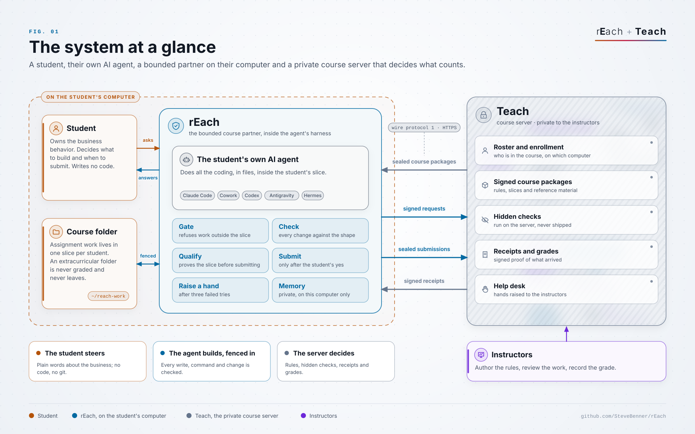

# reach

<p align="center">
  
</p>

> **AI agents:** read [`AGENTS.md`](AGENTS.md) first. Asked to install rEach from
> this repository's link? Follow [`INSTALL.md`](INSTALL.md).

The student's side of the course software: a harness plugin that installs into
Claude Code, Claude Cowork, Codex, Antigravity or Hermes and turns the student's own AI
agent into **rEach**, a bounded course partner for a
Teach-run course.

Until the student enrolls, rEach refuses everything else: it blocks every
prompt and asks the student itself, one at a time, for the class-wide course
passkey their instructor shared (like `BUS101-K7QX-94TD`), their institutional
username (their school email address) and their student ID, and last asks them to
choose a password (at least 8 characters, typed twice, to write down), so the
agent never sees any of it (it never even reaches the agent--it is captured via hooks). Teach checks them against its roster and returns a signed
enrollment stamp tied to a scrambled fingerprint of the computer and account;
a copied install locks until it is enrolled again (`specs/wire.yml`, W-ENR-1..7).
Teach keeps only a one-way hash of the password; `tools/fake_teach` is a local stand-in for the enrollment and password parts of the wire.

That password is also the last step of every sign-in: after the
student ID and the yes, rEach's prompt hook asks for it and keeps every gate
closed until it is right. Nobody can look a password up, and a student cannot
reset it: only their instructor can, with Reset password in Teach, and rEach
then asks the student for a new one at the next sign-in (`specs/wire.yml`,
W-ID-5).

rEach then introduces itself and runs a short intake
interview, saved on the student's computer only. It enrolls with Teach, receives
the student's protected course materials, refuses to let the agent work until
the instructors' guardrails are installed, keeps the agent inside the student's
slice, checks every change against the
[Dovetail](https://bitbucket.org/paterasai/dovetail) shape, has the agent prove
the slice with scenarios of its own before anything is submitted (`reach qualify`:
those scenarios here where they can run, then an ungraded run on Teach that also
runs the instructors' hidden checks), submits work and waits for Teach's receipt,
and raises a hand to the instructors on its own after three failed tries. The
student deals only with the business behavior; the agent does all the coding,
following Reach's feature and bug flows, without git (see ROADMAP.md).

While a student is signed in and working on an assignment, rEach records the
conversation (every prompt, reply, reasoning block, action, tool output and the
assignment code, whole and uncut) and sends it to Teach in the background about
every ten minutes, at an interval the course sets, where the instructors read it. It leaves the
computer de-identified: a random pseudonym instead of the student's name,
placeholders for the identifiers rEach knows, and an encrypted index that only
the holder of the course's key can open to re-identify it. Nothing is recorded
before sign-in, in the extracurricular folder or outside the course folder.
Instructors also receive the work the student submits, their own-part answers,
help requests the student agrees to send and usage information. The
course folder is `~/reach-work`, and rEach keeps its own files (keys, vault, state, the plugin) in
`~/reach-work/.reach-home` inside it, which the agent can never read or write: assignment code lives only in
`deliverables/<course>/<assignment>/<cutout>-<slice>/`, and anything else the
student wants to build goes in `extracurricular/` (`reach work
--extracurricular`), which is never graded and never leaves the student's
computer. The agent puts code in files, never in chat. The Stop and SessionEnd
hooks run `reach hook stop`, which only flushes debug events and shows the link
notice and the debug block.

## How it fits together

rEach is half of a system; Teach, the instructors' private course server, is the other half. On its own rEach is a
careful assistant with nobody to answer to. Teach is what makes its promises checkable: a roster, signed rules,
hidden checks, signed receipts and instructors who answer.

<picture>
  <source media="(prefers-color-scheme: dark)" srcset="docs/assets/figures/01-system-at-a-glance-dark.svg">
  
</picture>

[`docs/architecture.md`](docs/architecture.md) has ten figures: trust boundaries, the enrollment handshake, the work
lifecycle, the guardrail layers, who may do what, the privacy map, the deployment topology, why the two belong
together, and a poster. Teach is private, so each one shows what it guarantees and never how.
[`docs/deploy-and-test.md`](docs/deploy-and-test.md) (in a clone only) has worked examples for running and testing
rEach without a course server.

The full design is in [`reach.spec.yml`](reach.spec.yml); every byte between
Reach and Teach follows [`specs/wire.yml`](specs/wire.yml) (protocol 1).
Students: see [`docs/student-guide.md`](docs/student-guide.md), and for installing and enrolling,
[`docs/INSTALLATION-AND-SETUP-GUIDE.docx`](docs/INSTALLATION-AND-SETUP-GUIDE.docx) (`reach guide` prints its text;
until a student is enrolled, every session tells the agent to read it and finish the extra steps for the student's app).

## Runtime

Ruby 2.6.10 to 4.0.x, standard library only, no native gems. macOS's built-in
`/usr/bin/ruby` is enough to run rEach; local checks (`reach qualify`) need Ruby 3.2 or newer and otherwise use the
runtime kit's Ruby, which rEach installs by itself.
A computer with no Ruby needs nothing first: the plugin's hooks run `sh exe/reach-run`, which downloads
and verifies the runtime kit's Ruby in the background and then runs Reach with it (on Windows,
`scripts/reach-install.ps1` does the same for the install and adds it to the user PATH).

Local qualification runs the course's Cucumber suite, which needs Ruby 4 gems and Chrome. The session-start hook
installs Reach's runtime kit in the background when it is missing or is not the one Reach pins (`config.yml` `runtime.auto_install`), and `reach
runtime install` does the same by hand. It fetches Reach's runtime kit for this computer: Ruby 4.0.7 with the gems prebuilt and Chrome for Testing
154.0.8037.92, the same versions Teach grades with, verified against a manifest pinned in Reach and kept in
`~/reach-work/.reach-home/runtime/`. Reach itself keeps running on the student's own Ruby when there is one; otherwise on the kit's. [rplugin](https://bitbucket.org/paterasai/rplugin) is
optional: Reach uses its ports when it is installed and runs standalone otherwise.

## Install

Paste this repository's link into your AI agent and ask it to install rEach; it
follows [`INSTALL.md`](INSTALL.md). Or install it yourself:

| Harness | Command |
| --- | --- |
| Claude Code | `claude plugin marketplace add SteveBenner/rEach#stable` then `claude plugin install reach@reach --scope user` |
| Claude app (Cowork, Code tab) | Customize › Plugins › Add › Add marketplace, paste the link, add rEach |
| Codex | `codex plugin marketplace add SteveBenner/rEach@stable` then `codex plugin add reach@reach`, and trust rEach's two hooks (`/hooks`, or Settings > Hooks in the app) |
| Antigravity | run the one install command in `INSTALL.md` with `--harness antigravity` |
| Hermes | run the one install command in `INSTALL.md` with `--harness hermes`; open course folders with `~/reach-work/.reach-home/bin/reach work --harness hermes` (setup prints the exact command) |
| Any of the above | install the public GitHub archive to `~/reach-work/.reach-home/plugin`, then run `exe/reach setup` from the path the installer prints |
| rplugin | `rplugin install ~/.rplugins/reach` |

Installing from a link needs the repository and its pinned Dovetail archive to be public.

Antigravity runs no hooks, so rEach cannot ask for enrollment details in its chat: a locked Antigravity session has the
agent walk the student through `reach enroll` in a terminal window instead (`STD-NOHOOK-ENROLL`).

A student who later changes AI app on the same computer runs `reach harness move --to <app>`, or asks rEach in a chat,
and stays enrolled; rEach stays in the old app too (`STD-HARNESS-MOVE`).

### Updates

An install at `~/reach-work/.reach-home/plugin` updates itself. rEach looks for the version the `stable` branch points at
when a session starts and once an hour while you work, downloads it in the background, and installs it
when your next session starts, through the release's own `update/apply.rb`. Progress is kept in
`~/reach-work/.reach-home/state/update.json`, so an interrupted update picks up where it stopped. `reach update status` shows where
things stand and `reach --version` prints the installed version; `reach update run --apply` installs now; `REACH_UPDATE_DISABLE=1` turns updates off. A git checkout
is never updated. Marketplace installs follow the `stable` branch too. `stable` moves only to the Latest release, at most
once a day: the `stable` workflow (`.github/workflows/stable.yml`, 15:00 UTC) runs the platform smoke on the Latest tag
and moves `stable` with `tools/stable_promote.rb` only when every leg passes; a failed smoke holds `stable` and opens a
`stable-hold` issue. A release that changes `hooks/` first gets a notice ref, which rEach shows to Codex students
(Codex asks them to approve changed hooks again), and reaches `stable` no sooner than the next day.
`ruby tools/release_stable.rb vX.Y.Z` still moves `stable` by hand.

Hermes keeps hooks and MCP servers in a profile's `config.yaml`, never per
folder, so setup creates a Hermes profile named `reach` (`hermes profile create
reach --clone --no-alias`, which copies the student's model settings and adds
no `reach` wrapper command) and Reach keeps its hooks, its MCP bridge and a
disabled `code_execution` toolset in that profile only. `reach work --harness
hermes` starts `hermes -p reach --accept-hooks chat` in the course folder; the
student's own Hermes profiles are never changed. Hermes started any other way
is not gated, and a prompt the gate refuses still reaches the model, marked as
refused, because Hermes cannot block a prompt.

## Directives, check, plan and checkpoints

Every course workspace's `AGENTS.md` ends with a directive table: one row per
rule with its opcode, condition and enforcement, in the same form as the fleet's
own agent directives. The engineering rows ship here in
[`directives/`](directives/); the course rows arrive inside Teach's encrypted
guardrails package as rows only: `reach directive <OPCODE>` asks Teach for the
one body, which is never stored on the student's computer, and shows the
one-line rule when offline.

```
reach check [--changed <path>] [--format text|agent|json]   the one checker the hooks run
reach plan save|note|show                                    the slice plan, read back each session
reach checkpoint save|list|show|restore <n>                  snapshots of the slice, no git needed
reach directive <OPCODE> | --list                            the directive bodies
reach reference list | show <path> | search <words> | links | ingest [--force]  the course reference material
```

Every owned file carries an invisible seal and every session leaves a witness
ledger; Teach reads both when it assesses a submission's provenance. A
submission with `reach check` findings is sent back once with the findings and
refused the second time, raising a hand to the instructors.
Since 0.42.0 each request rEach signs also names the harness, operating system, CPU architecture and Ruby version
it runs on, so your instructors can see which combinations work; it carries nothing about you or your files
(`REACH_ENV_REPORT_DISABLE=1` turns it off).

Since 0.41.0 README.md must keep its five template sections with at least 25 words each,
written from the student's own answers: `reach check` reports CK-README, `reach qualify`
stops at its check step and `reach submit` refuses until it does.

## Memory

rEach keeps a private memory of what it learns about the student and their work, on this computer only. Each
prompt the student types, in any folder, is kept as a private source as it arrives (never the AI's replies, never a prompt rEach blocked or one that looks like a secret); the agent records durable
findings (a preference, a goal, a decision, a struggle, a skill, a project, a fact) with `reach remember`, and rEach
adds the profile at session start and the matching memories on each prompt. A novelty check and a write budget stop
floods, the spool is capped at `max_spool_bytes` (the oldest unreferenced sources are pruned first), and nothing here is sent to Teach. Ask rEach what it remembers, or run `reach memory list`; `reach memory
forget <id>` or `reach memory forget --all --yes` erases it from rEach's files. The settings are in `config.yml`
under `brain`.

Once the runtime kit is present, rEach also installs its small SDK kit (rplugin and rBrain, verified against a manifest
pinned in rEach) and organizes the memory into its own rBrain corpus in `~/reach-work/.reach-home/corpora/reach`, in a
background helper that never slows a hook. Recall then searches that corpus, and forgetting erases from it too.
`reach sdk status` shows the kit and `reach doctor` the route; without the kit, rEach works exactly as before.

```
reach remember --category C --claim TEXT --evidence TEXT [--supersedes ID]   keep one finding (the agent runs this)
reach memory [list | show ID | forget ID... | forget --all --yes | export]   see, export or erase what it remembers
reach sdk [install [--from DIR] | status [--json]]                           install or show the SDK kit
```

### Storage

rEach watches how much space its saved course memory and what it has learned take together. At 512, 1024 and
2048 MB it says so once and offers to compact the saved course memory; at 4096 MB it asks for compaction, suggests a
real backup to another drive and stops imports until it is done. What rEach has learned is never compacted.

```
reach storage [status | measure | compact] [--format json]   how much space rEach uses, and compacting it
reach transcripts export | forget                            save your conversations as a ZIP, or delete every local copy
```

Saved conversations are deleted from this computer 180 days after the course ends (unsent ones after 30), and the
ZIP export after the course is made only when `transcripts.auto_export` is true. `PRIVACY.md` lists every copy and
how long it is kept.

### Importing another AI's history

Ask rEach to import an export from ChatGPT, Claude or Gemini (a folder or the ZIP you downloaded). It can only learn
from it, or also keep a full copy in its course memory; without the copy, deleting the export loses its full text.
Reading a large export takes a while in the background, and learning from it runs across many sessions.

```
reach import pick [--folder]                         choose the export with the system's file picker
reach import export PATH --mode brain|copy           start an import after the student agrees
reach import status|cancel|list [JOB]                follow or stop an import
reach import next|done|search|show ...               what the agent reads to learn from it
```

## Instructors

An instructor can try rEach without enrolling. Mint a code on the Teach console's Instructor codes page, then
paste it into the locked prompt in any harness: rEach intercepts it, so the agent
never sees it, and stops blocking prompts on that computer. rEach checks the code against the instructor keyring Teach
publishes (it fetches it at session start and before checking a code, keeps a copy for offline use, and refreshes every
`instructor.keyring_refresh_s` seconds in `config.yml`, 900 by default); with no copy and no connection it says it could
not reach the course server.
On an enrolled computer, the same code typed at any prompt, even mid sign-in or during a lockout, signs that one chat in
and clears the lockouts, and lets that chat through any enrollment lock; the code is not stored, nothing stays unlocked
on the computer, and a new chat asks for sign-in as usual. `reach instructor unlock` does it from a terminal when no hook
runs: run it with no argument and paste the code when asked (it stays hidden and out of your shell history).
On a computer that is not enrolled, `reach instructor status` shows the unlock and the keyring revision, age and key ids,
and `reach instructor lock` undoes it. Keep codes out of chats and repositories. To revoke a code, use Revoke on the
Teach console; rotating the key there makes every code from the old key stop working at once, on the next keyring refresh.

An unlocked install can also run as a test student, to go through the course exactly as a student does:
`reach instructor dummy [--course ID]` starts a blank test student and `reach instructor as <username> [--course ID]`
a test copy of that roster student, with their group, slices, modules, submissions and receipts as of now. Teach makes
the test student; nothing you do reaches the real student's record, and everything you send is filed on Teach as
instructor data. The persona keeps its own rEach home under `~/reach-work/.reach-home/personas/` and its own folders under
`~/reach-work/personas/`, applies to every harness session on the computer, and ends with `reach instructor exit`,
which moves it to `.backup`. Teach must pin the same key in its course policy and run 0.17.2 or later.

An unlocked install can start a diagnosis session, to work out a rEach problem on that computer together
with the instructor's assistant: `reach instructor diagnose [--course ID]`, or ask the assistant to start one. rEach
asks one question; on your typed yes the session opens at once, the two assistants write to each other, and rEach
runs the checks the instructor's side requests without asking again. On a computer that is not enrolled rEach makes
a blank test student first. The unlock code stays on that computer until `reach instructor lock` removes it, so run
that when you are done on a computer that is not yours.

Debug mode is always on for a test student, and otherwise only on request: `reach debug on [--for MINUTES]` and
`reach debug off` on the computer, or an instructor switches it on from Teach, in which case the student is told. It
records what rEach did (hooks, gate decisions, requests to Teach, sync, check, qualify, submit, errors), never prompt
or file text, codes, passwords or keys, sends it to Teach, and shows it at the end of each turn: an ASCII table in a
terminal harness, a Markdown table in a desktop or IDE app (`debug.render` in `config.yml` overrides it).
`reach debug show` prints the latest events, `reach debug status` says whether it is on and why.

Until a student has enrolled, rEach also keeps a setup log on the computer (`setup-log/` in the rEach home): every
command, hook, request and response, error with its full backtrace, and the computer's Ruby and operating system,
never passwords, the passkey or anything the student typed. It is never sent. After three setup failures in a row
rEach saves `reach-setup-report-<time>.json` in the student's Downloads folder, shows where it is, and suggests
sending it to the instructor; `reach debug export` saves one at any time. Saying "enable debug mode" works before
enrollment too: the enrollment hook switches it and asks its question again. `REACH_SETUP_LOG=0` turns the log off.

Codex runs an agent's shell commands in its own sandbox, and outside a course folder the student has trusted that
sandbox blocks the internet and rEach's folder. A rEach command that the sandbox stops says so in plain
words, and the agent turns debug mode on or off and runs the health check
through the `reach_debug` and `reach_doctor` tools, which Codex runs outside its sandbox. The `reach_update` tool
updates rEach the same way.

rEach also fixes the cause: after the student says yes, it changes the student's own Codex settings
(`$CODEX_HOME/config.toml`) so Codex's commands may use the internet and write inside the reach-work folder, and marks
that folder as trusted (mode `workspace`; on Windows mode `full` turns Codex's sandbox off instead). It saves a copy of
the old settings beside the file first, changes nothing else, and refuses rather than guess when the file holds
something it does not read. The student answers on a terminal (`reach codex configure`, which the Windows installer
runs after setup), in a chat when the agent calls the `reach_setup` tool, or during a live session. `reach codex
status`, `reach codex probe` and `reach doctor` show where it stands, and `reach codex off` stops rEach putting the
settings back. `codex.setup: false` in `config.yml` or `REACH_CODEX_SETUP=0` turns it off.

rEach also tells the agent about known problems the instructors have recorded in Teach for this
computer's operating system and AI app: each session's context names the ones that match, and marks one rEach can see
happening now, and the agent gets the student's steps from the `reach_known_issues` tool (or `reach known-issues`).
This works before enrollment, and from the last saved copy when the course server can't be reached.

rEach also reports its own technical problems by itself. A fault that stops enrollment, sign-in, sync,
qualify or submit is reported the first time it happens, any other the third time in a day, as a hand of type
`issue` holding where it happened and what rEach was running, never an error message, a prompt or code. The student
is told once that it was reported and that nothing is needed from them, and once more when the fix reaches their
version. The report names the rEach version the problem happened on, even when it is sent after an
update. `reach issues` lists what was seen and reported (test student or debug mode), `reach issues flush` sends
what is waiting, and `REACH_ISSUES_DISABLE=1` or `issues.enabled: false` in `config.yml` turns it off.

rEach also tells the course server where a student stands: the time they first passed each step of
enrolling, first signed in and first started each assignment. It sends the step and its time only, on `reach sync`, and the instructors see it as a progress bar per student.
`REACH_PROGRESS=0` turns it off.

### Submitting

Once a slice's work passes `reach qualify`, the agent tells the student they can ask rEach to submit it.
`reach submit` (or the `reach_submit` tool) runs every check first, then asks the student through rEach; the agent
relays the question word for word, the prompt hook captures the answer, and only a yes, given within 30 minutes for
exactly the files it was asked about, lets the agent's next `reach submit` send the work. Run in a terminal,
`reach submit` asks at its own prompt; on Antigravity, which has no hooks, the agent asks first. Once Teach's ingest
receipt verifies, rEach saves a ZIP of the whole assignment folder (every slice, without rEach's and the harness's own
files, plus the receipts and the student's own part) in the Downloads folder as
`<assignment>-<email local part>-<YYYYMMDD>.zip` (such as `A1-jruiz-20261007.zip`) dated in course time, never overwriting a file
(`REACH_DOWNLOADS_DIR` overrides the folder; `config.yml` `submit.archive_max_mb`, default 256, caps it). The student
may submit again until the due time and the last one counts. After the due time a slice already submitted is refused,
by rEach before it asks and by Teach. rEach says plainly, before and after every submission, that the ZIP in
Downloads must also be uploaded to the course's learning system to receive credit, when the course requires it (the
course names that system); `reach submit archive` makes the ZIP again.

### Late work and grades

A student may keep working on an assignment after its due time: rEach says clearly and repeatedly that
the work is late, lets the instructor know once, and says when it can no longer be submitted. `reach grade` shows the
points the instructor has recorded in Teach, when there are any.  A hand raised for help carries a type (a grade question, a technical issue, an extension request and so
on) so the instructor sees what it is about.

### Announcements and course updates

An instructor can send an announcement to the whole course, one group or one student. rEach fetches
it on the next sync, shows it once, word for word, and keeps it in a queue the student can list by date with
`reach announcements`. When an assignment's due time moves, rEach says so once, with the earlier and the new time.
After each sync rEach also tells the course server which copy of the course materials it holds (names and check
values only), so an instructor can see that an update reached every student.

The agent receives an announcement in a frame that says when it was sent and that it is information, so it
never stops helping because of one. An announcement may carry a time until which it is shown; one that passed before
the student saw it is not shown, and `reach announcements` lists it with "(shown until ...)".

### Course controls and tests

The instructors can set a pause, a hold or a test, and rEach enforces each one in code
(`agent_control.controls` and `agent_control.test_mode` in `config.yml`). A pause stops course work in a slice and in
the workspace root, and leaves the student's own extracurricular folder and `reach support` working. A hold stops
`reach submit` only; checks and `reach qualify` keep working. While a test is open, only the test, `reach support` and
`reach status` work. The test runs through `reach test [status | open | questions | record QUESTION | submit]` or the
`reach_test` tool: the questions are shown word for word, and an answer is recorded only from what the student typed in
their own message, never from the agent. The agent may explain the wording of a question and nothing more. The text
the agent is shown comes from the bundled `agent-control/agent-control.yml` (`agent_control.render` in `config.yml`);
`reach doctor` checks it.

### Extra credit

When the instructor texts a student an extra-credit code, the student gives it to rEach with their answer, at any time:
`reach extra-credit XC-ABCD-EFGH "my answer"`, or just tell the agent. rEach keeps it in the student's profile and sends
it to Teach, or keeps it until the next sync when Teach cannot be reached. `reach extra-credit list` shows what is
recorded. Only this part of the profile goes to Teach; the getting-to-know-you answers never leave the computer.

```
reach grade [--format json]                     the points recorded in Teach
reach submit archive [--assignment A]           make the assignment's ZIP again
reach hand raise --type T ...                   raise a hand of a given type
```

### When Teach can't be reached

rEach never shows a raw error, backtrace or hook failure. When a request to Teach fails for lack of a
connection, the student is told once per outage that the connection was lost and that their work is saved and will be
sent when it is back, and once when it returns (a `systemMessage` on Claude Code and Codex, a relay line in the prompt
context on Hermes, a line on stderr from a command). `REACH_OFFLINE=1` is deliberate and is not an outage. Any other
error, which rEach shows as a plain message (at most once every 15 minutes in a hook), is recorded as a `fault` event,
and each change of connection as a `link` event. Both are sent to Teach even while debug mode is off, with the failing
location, exception class and a few plugin-relative frames but no error message, file or prompt text; instructors read
them in Teach. The state lives in `link.json` under the rEach home, and `config.yml`
`link.hiccup_quiet_minutes` and `link.fault_max_per_hour` set the quiet period and the hourly cap.

## Course reference

Reference material never ships in this repository. From enrollment on, Teach sends each
install its own course's encrypted `.rref` blobs, every unit, and their keys in the signed
guardrails package at `reach sync`. `reach reference list|show|search|links` decrypts in memory.
rEach also ingests the whole course corpus into the student's microbrain: after each
sync, and at session start when the blobs changed, it spools every file as a private source under
`course/<course>/`, and matching passages join each prompt's recall (`brain.course_recall`,
`course_k`, `course_budget_bytes`, `course_min_score`). That private tier is the only plaintext
copy. `reach reference ingest [--force]` runs the ingest on demand. Before enrollment, or before
the key arrives, the material is reported as locked.

## Doctor

```
reach doctor
```

## Release gate (maintainers)

A release push (a tag `v*`, or a branch whose `VERSION` changes) runs `tools/release_gate/gate.rb` from
`.githooks/pre-push`. `tools/release_gate/install` sets `core.hooksPath` and prints the token steps: a Teach service
token minted for the release gate at `~/.config/release-gate/reach/token` (mode 0600) or
`RELEASE_GATE_TOKEN`, and Teach's address from `config.yml` `teach.url` or `TEACH_URL`. `specs/release_gate.yml` names
every check. `ruby tools/release_gate/gate.rb check` is the dry run; with `--as-push` it exits as the push would, passing when a lease or a covering override would let the push through without consuming the override. There is no skip switch; the instructor's
one-push override is `ruby tools/release_gate/gate.rb override --reason TEXT [--hours N] [--checks ID,ID]`, typed on
a terminal and recorded on Teach. A lease is the other way through: with a lease source in
`~/.config/release-gate/lease_source.yml`, a push that would block passes while a valid, unexpired lease for this
repository answers, and the run is still checked and recorded as leased. `reach doctor` reports `R-DOC-GATE` when a clone that pushes over SSH has no gate.

## Smoke test

The test and release tooling below lives in a clone only: `.gitattributes` keeps `tools/`,
`.githooks/`, `.github/` and the smoke and deploy notes out of the archive a student's install and updates download.

Before tagging a release that changes anything a student sees, run the sandboxed
smoke test: real Claude sessions with rEach loaded, in Docker, with scripted and
model-played students. See [`tools/smoke/README.md`](tools/smoke/README.md).

```
ruby tools/smoke/run.rb
```

## Unit tests

`tools/tests/` holds Minitest files for `Reach::HarnessSource.codex_bin` (the `CODEX_CLI_PATH` name check) and
`tools/release_stable.rb` (Latest-only, fast-forward-only moves of `stable`, against a scratch bare origin). Each runs
on its own:

```
ruby tools/tests/harness_source_test.rb
ruby tools/tests/release_stable_test.rb
```

## Platform smoke

`tools/platform_smoke/run.rb` installs Reach from this checkout and runs its commands and hook command lines
against the fixture Teach on Linux, macOS and Windows, with no agent and no secret.
`.github/workflows/platforms.yml` runs it on every push to main. See
[`tools/platform_smoke/README.md`](tools/platform_smoke/README.md).

```
ruby tools/platform_smoke/run.rb
```

## Figures

`tools/figures/build.rb` draws the figures in `docs/assets/figures/`, light and dark, from one description each;
`--png` also renders 4K PNGs with headless Chrome. See [`tools/figures/README.md`](tools/figures/README.md).

```
ruby tools/figures/build.rb
```

## Policy sources and enforcement

rEach's public engineering rules and runtime policy parameters live in `specs/polispec/behavior.yml`. The released plugin reads compiled `policy/behavior.json` using its own standard-library adapter. Student machines do not need Polispec or rStack. Teach remains the authority for course rules, assignments, and instructor controls; existing course packages work without a server migration.

`reach policy --json` reports policy authorities, digests, coverage modes, and drift without private directive bodies. `reach doctor` checks the generated directive views, native enforcement bindings, and pinned instructor-control baseline. Existing shell, ownership, qualification, submission, privacy, and support behavior remains in rEach's native code; advisory instructions are labeled honestly.

For developers, edit the source and run `ruby tools/policy.rb build`, then `ruby tools/policy.rb check`. Polispec is an authoring tool only. Development/release policy and persona routing use the separate `specs/polispec/policy.yml` and `roster.yml`; they require host-ledger activation. Stable readiness checks the planned commit, and promotion remains an operator action through `polispec promote reach --to stable`.
