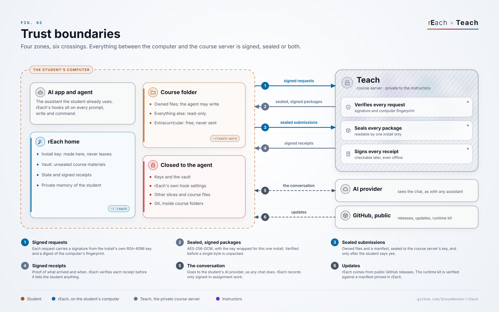
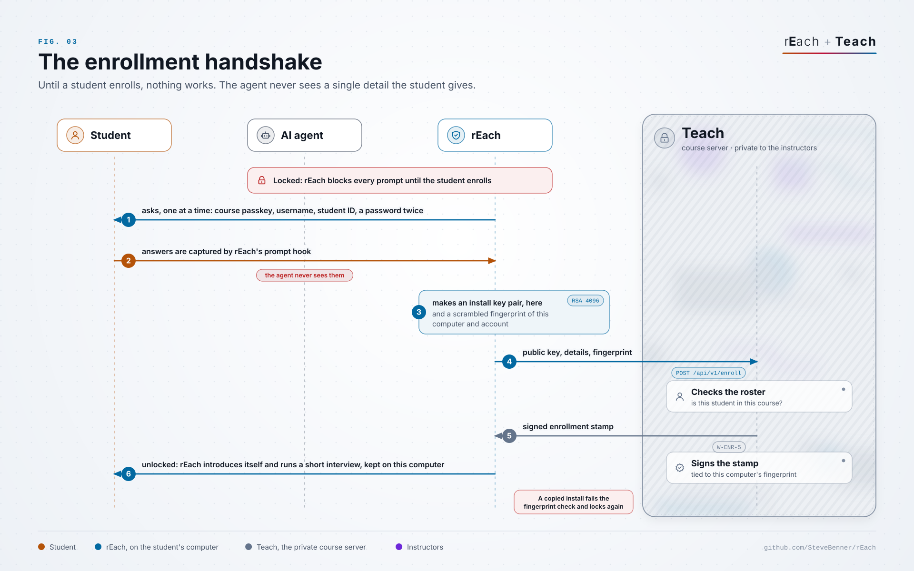
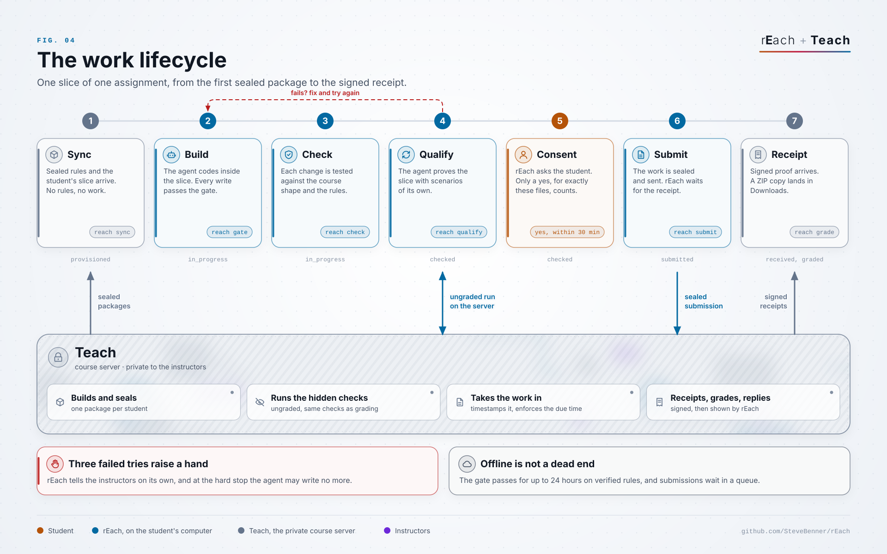
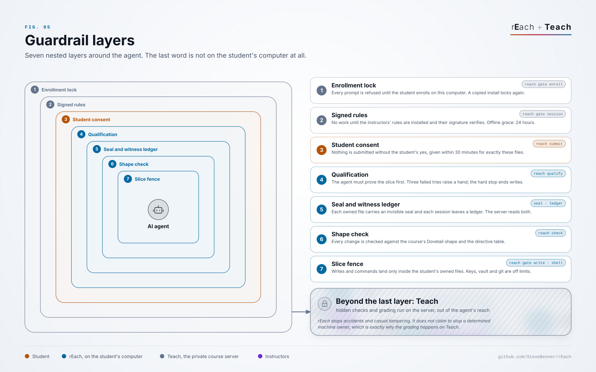
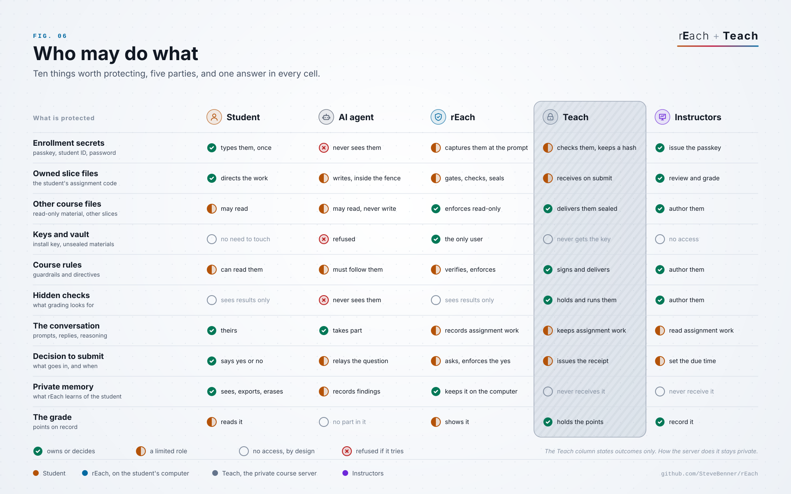
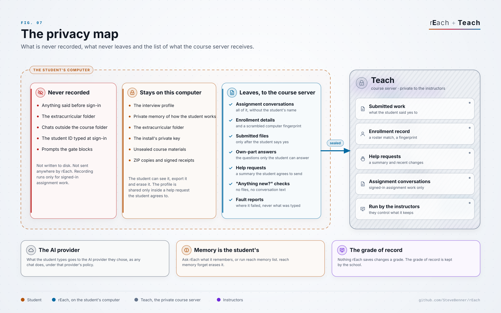
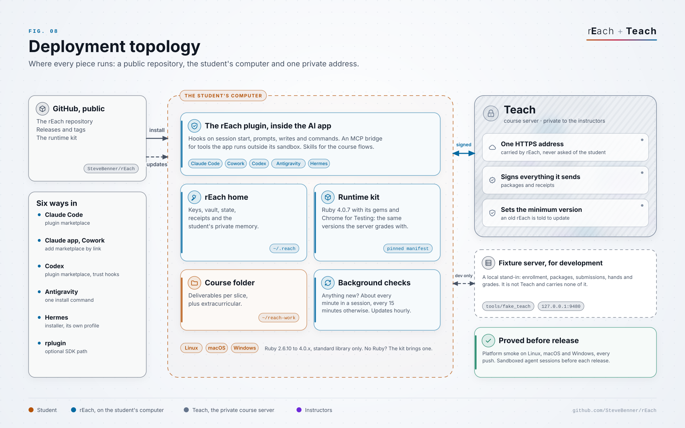
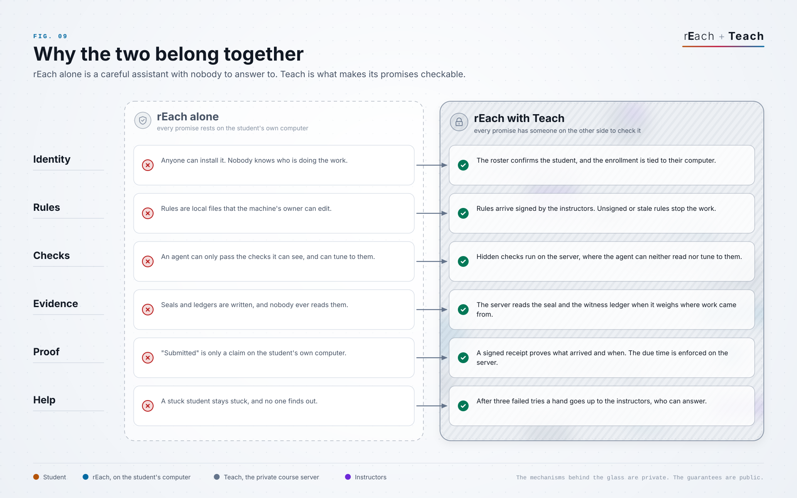
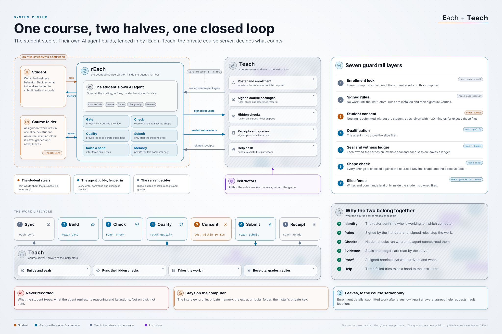

# rEach and Teach: the system in figures

rEach is half of a system. It runs on the student's computer, inside their own AI agent; [Teach](https://bitbucket.org/paterasai/teach) is the course server the instructors run. These ten figures show the two together: who is involved, what crosses between them, what guards the agent, who may do what, and what never leaves the student's computer.

Teach is private. Every figure draws it as a frosted block and names only what it guarantees, never how it does it. Everything the figures say about Teach is already published in this repository, in [`README.md`](../README.md), [`PRIVACY.md`](../PRIVACY.md) and [`specs/wire.yml`](../specs/wire.yml).

Each figure follows your GitHub theme, light or dark. The files are in [`assets/figures/`](assets/figures/) as `<name>-light.svg` and `<name>-dark.svg`; a 4K PNG of each is attached to the [`figures-1` release](https://github.com/SteveBenner/rEach/releases/tag/figures-1). They are drawn by [`tools/figures/`](../tools/figures/README.md).

| Color | Stands for |
| --- | --- |
| amber | the student and what is theirs |
| blue | rEach, on the student's computer |
| frosted gray | Teach, the private course server |
| violet | the instructors |

## 1. The system at a glance

<picture>
  <source media="(prefers-color-scheme: dark)" srcset="assets/figures/01-system-at-a-glance-dark.svg">
  
</picture>

The student owns the business behavior and writes no code. The agent does all the coding, in files, inside the student's slice. rEach gates, checks, qualifies and submits. Teach holds the roster, signs the course packages, runs the hidden checks, signs the receipts and carries hands to the instructors.

4K PNG: [light](https://github.com/SteveBenner/rEach/releases/download/figures-1/01-system-at-a-glance-light.png) · [dark](https://github.com/SteveBenner/rEach/releases/download/figures-1/01-system-at-a-glance-dark.png)

## 2. Trust boundaries

<picture>
  <source media="(prefers-color-scheme: dark)" srcset="assets/figures/02-trust-boundaries-dark.svg">
  
</picture>

Everything between the computer and the course server is signed, sealed or both (`specs/wire.yml`: request signatures, sealed envelopes, signed receipts). The conversation goes to the student's AI provider as any chat does; rEach records none of it. Updates come from this repository's public releases.

4K PNG: [light](https://github.com/SteveBenner/rEach/releases/download/figures-1/02-trust-boundaries-light.png) · [dark](https://github.com/SteveBenner/rEach/releases/download/figures-1/02-trust-boundaries-dark.png)

## 3. The enrollment handshake

<picture>
  <source media="(prefers-color-scheme: dark)" srcset="assets/figures/03-enrollment-handshake-dark.svg">
  
</picture>

Until a student enrolls, rEach blocks every prompt. It asks for the course passkey, username, student ID and a password itself, through its prompt hook, so the agent never sees them. It makes the install key pair and a scrambled fingerprint on the computer; Teach checks the roster and answers with a signed stamp tied to that fingerprint (W-ENR-1..7). A copied install fails the fingerprint check and locks again.

4K PNG: [light](https://github.com/SteveBenner/rEach/releases/download/figures-1/03-enrollment-handshake-light.png) · [dark](https://github.com/SteveBenner/rEach/releases/download/figures-1/03-enrollment-handshake-dark.png)

## 4. The work lifecycle

<picture>
  <source media="(prefers-color-scheme: dark)" srcset="assets/figures/04-work-lifecycle-dark.svg">
  
</picture>

Sync, build, check, qualify, consent, submit, receipt. The state names under each stage are the `slice_workspace` states in `reach.spec.yml`. Three failed qualifications raise a hand to the instructors; offline, the gate passes for up to 24 hours on verified rules and submissions queue.

4K PNG: [light](https://github.com/SteveBenner/rEach/releases/download/figures-1/04-work-lifecycle-light.png) · [dark](https://github.com/SteveBenner/rEach/releases/download/figures-1/04-work-lifecycle-dark.png)

## 5. Guardrail layers

<picture>
  <source media="(prefers-color-scheme: dark)" srcset="assets/figures/05-guardrail-layers-dark.svg">
  
</picture>

Enrollment lock, signed rules, student consent, qualification, seal and witness ledger, shape check and slice fence, each with the command that enforces it. rEach's protections stop accidents and casual tampering; they are not a guarantee against a determined machine owner, which is why grading happens on Teach (`reach.spec.yml`, `security.honesty`).

4K PNG: [light](https://github.com/SteveBenner/rEach/releases/download/figures-1/05-guardrail-layers-light.png) · [dark](https://github.com/SteveBenner/rEach/releases/download/figures-1/05-guardrail-layers-dark.png)

## 6. Who may do what

<picture>
  <source media="(prefers-color-scheme: dark)" srcset="assets/figures/06-permissions-dark.svg">
  
</picture>

Each cell says whether a party owns or decides, has a limited role, has no access by design, or is refused if it tries. The Teach column states outcomes only.

4K PNG: [light](https://github.com/SteveBenner/rEach/releases/download/figures-1/06-permissions-light.png) · [dark](https://github.com/SteveBenner/rEach/releases/download/figures-1/06-permissions-dark.png)

## 7. The privacy map

<picture>
  <source media="(prefers-color-scheme: dark)" srcset="assets/figures/07-privacy-map-dark.svg">
  
</picture>

The picture of [`PRIVACY.md`](../PRIVACY.md). Signed-in assignment work is recorded and sent to Teach; nothing else said is. The profile, the private memory, the extracurricular folder and the install key stay on the computer. Teach receives enrollment details, submitted work after a yes, own-part answers, agreed help requests, change checks and fault locations.

4K PNG: [light](https://github.com/SteveBenner/rEach/releases/download/figures-1/07-privacy-map-light.png) · [dark](https://github.com/SteveBenner/rEach/releases/download/figures-1/07-privacy-map-dark.png)

## 8. Deployment topology

<picture>
  <source media="(prefers-color-scheme: dark)" srcset="assets/figures/08-deployment-topology-dark.svg">
  
</picture>

rEach installs from this repository into Claude Code, the Claude app, Codex, Antigravity or Hermes on Linux, macOS or Windows. `tools/fake_teach` is a local stand-in for development and is not Teach. [`deploy-and-test.md`](deploy-and-test.md) walks through it.

4K PNG: [light](https://github.com/SteveBenner/rEach/releases/download/figures-1/08-deployment-topology-light.png) · [dark](https://github.com/SteveBenner/rEach/releases/download/figures-1/08-deployment-topology-dark.png)

## 9. Why the two belong together

<picture>
  <source media="(prefers-color-scheme: dark)" srcset="assets/figures/09-why-together-dark.svg">
  
</picture>

Alone, every promise rEach makes rests on the student's own computer. With Teach, each one has someone on the other side to check it: a roster, signed rules, hidden checks, a reader for the seal and ledger, signed receipts and instructors who answer.

4K PNG: [light](https://github.com/SteveBenner/rEach/releases/download/figures-1/09-why-together-light.png) · [dark](https://github.com/SteveBenner/rEach/releases/download/figures-1/09-why-together-dark.png)

## 10. The whole system on one sheet

<picture>
  <source media="(prefers-color-scheme: dark)" srcset="assets/figures/10-system-poster-dark.svg">
  
</picture>

For slides and print. The 4K PNG is the one to project.

4K PNG: [light](https://github.com/SteveBenner/rEach/releases/download/figures-1/10-system-poster-light.png) · [dark](https://github.com/SteveBenner/rEach/releases/download/figures-1/10-system-poster-dark.png)
